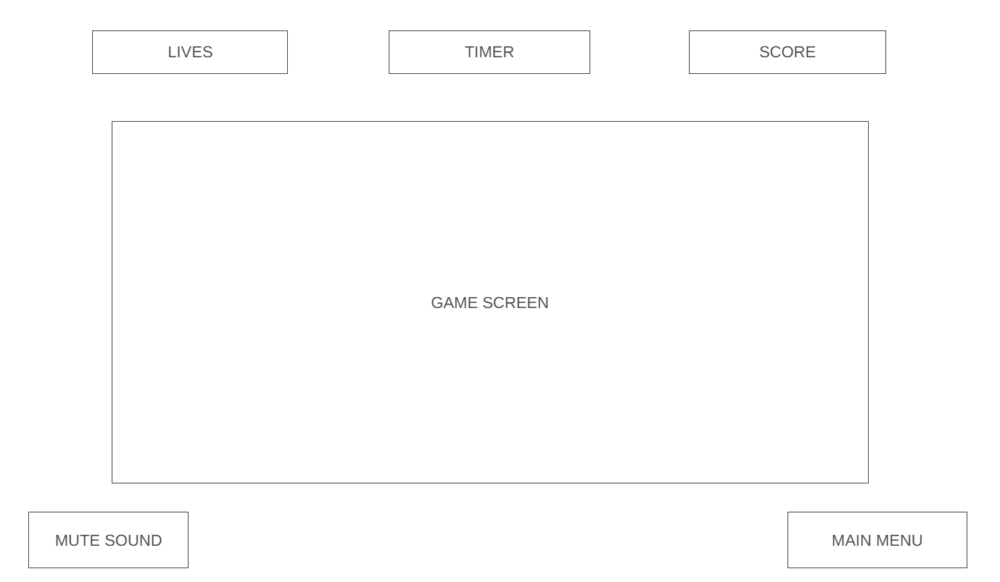

# ClickFrenzy - JavaScript Project

[Visit my GitHub!](https://github.com/Dominic5591)

## Background

ClickFrenzy is a JavaScript game where players aim to click and pop bouncing balls that float around the game canvas. The balls will bounce off walls and each other, creating a dynamic environment. The objective is to strategically click on the balls to make them expand and 'pop', triggering chain reactions that can hit other balls. The game incorporates a timer, a scoring system, and a challenge aspect where players receive X's for each missed click. If a player has three X's, they lose the game. Players can submit their initials along with their points, and the game uses local storage to store this information.

## Functionality & MVPs

Players in ClickFrenzy can:

- Click on balls to make them expand and pop.
- Ball physics, bouncing off walls and interactions with other balls.
- Earn points for clicking and poping balls and bonuses for chain reactions.
- Face a challenge system with three X's indicating a loss if three clicks are missed.
- Submit initials and points for a local high score.

In addition, this project will include:

- Instructions for the users.
- Feedback for successful pops and missed clicks.
- A option to mute sound/music.

## Wireframes

[Checkout my Wireframe!](https://wireframe.cc/pro/pp/5c6b09031708127)

## Technologies, Libraries, APIs

- HTML, CSS for structure and styling.
- Vanilla JavaScript for game logic.
- Local storage for high scores and game progress.

## Implementation Timeline

- **Friday Afternoon & Weekend:**

  - Set up the project structure and basic HTML/CSS.
  - Implement the game canvas and initial ball rendering.
  - Add basic click functionality for expanding and popping balls.

- **Monday:**

  - Ball physics and bouncing off walls.
  - Chain reactions for balls.
  - Add scoring system and timer.

- **Tuesday:**

  - Add X's for missed clicks.
  - Add animation for successful pops and misses.
  - Test and debug.

- **Wednesday:**

  - Local storage for high scores and game progress.
  - Uer interface and game styling.
  - Conduct testing and address any issues.

- **Thursday Morning:**
  - Testing and debugging.
  - Project presentation.
