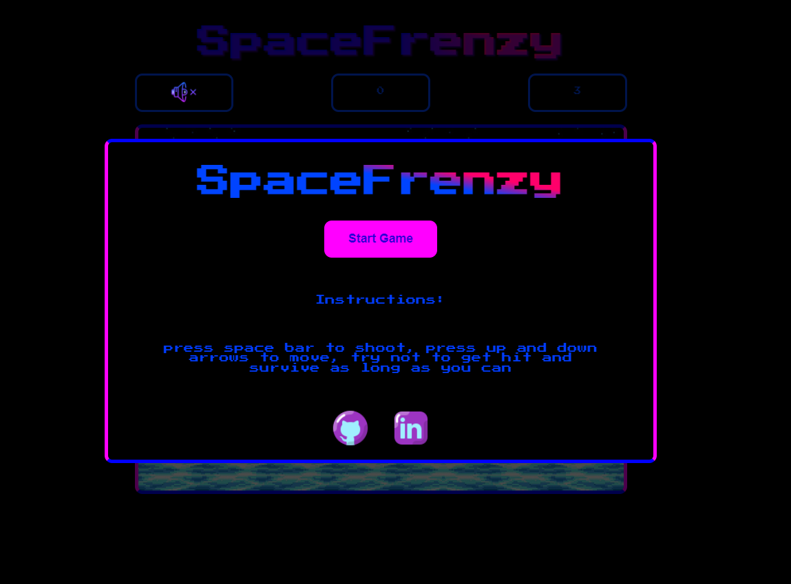
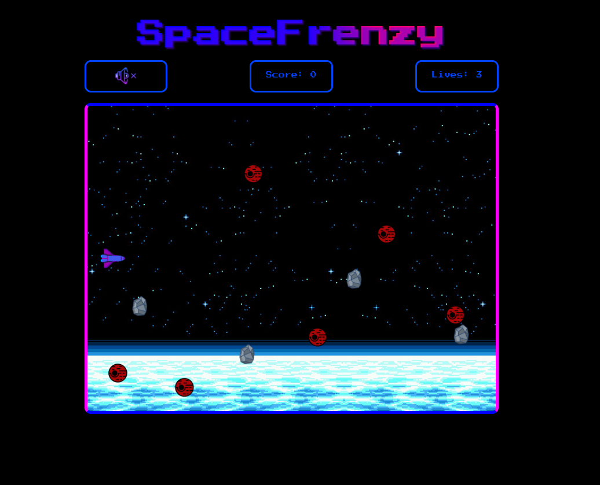
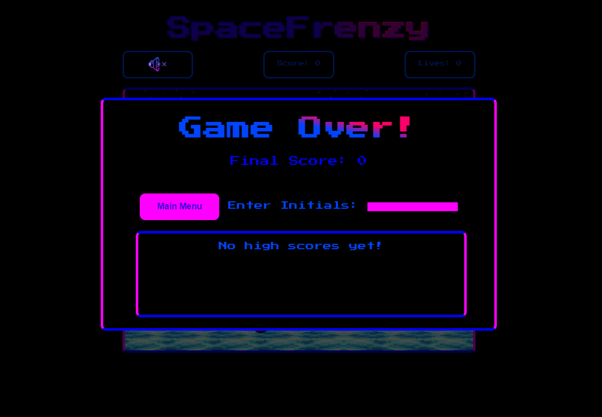
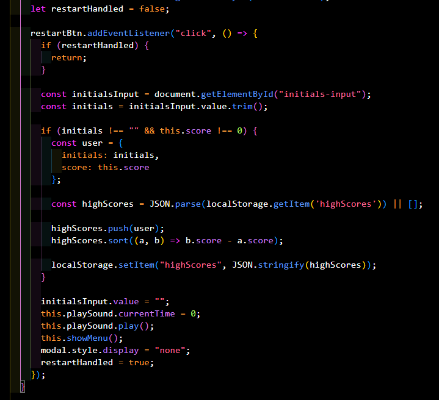
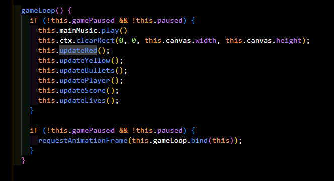
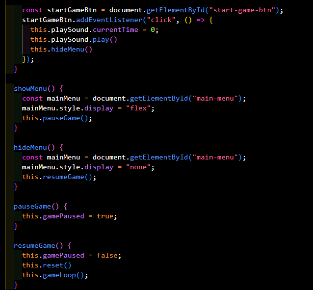

# SpaceFrenzy - JavaScript Project

[Visit my GitHub!](https://github.com/Dominic5591)

[Play Game!](https://dominic5591.github.io/space-frenzy/)

# SpaceFrenzy

SpaceFrenzy is a retro-style space shooter game made using vanilla JavaScript and Canvas where players control a spaceship to navigate through space, avoiding obstacles, and shooting down enemies and getting a high score

## Controls

- **Up Arrow**: Move spaceship up
- **Down Arrow**: Move spaceship down
- **Spacebar**: Shoot

## Features

- Responsive controls
- High-score tracking

## Technical Details
SpaceFrenzy is coded completely in vanilla Javascript. The game is drawn onto a canvas element and updated using the browser's requestAnimationFrame function and using localStorage to store users highscore. Additional functionality is added to buttons and other elements outside of the canvas by manipulating DOM objects with javascript.

## Technologies, Libraries, APIs

- HTML, CSS for structure and styling.
- Vanilla JavaScript for game logic.
- Local storage for high scores and game progress.
- Webpack to bundle JS files

## The high score system is stored using localStorage

## The main game loop is using requestAnimationFrame

## The main menu modal

## Future Implementation

- Want to add boss enemies and items
- Would like to add global storage

## Credits
- <a target="_blank" href="https://icons8.com/icon/oaQdQ0hfJiHw/galaxy">Space</a> icon by <a target="_blank" href="https://icons8.com">Icons8</a>

- Sound Effect from <a href="https://pixabay.com/?utm_source=link-attribution&utm_medium=referral&utm_campaign=music&utm_content=68698">Pixabay</a>
